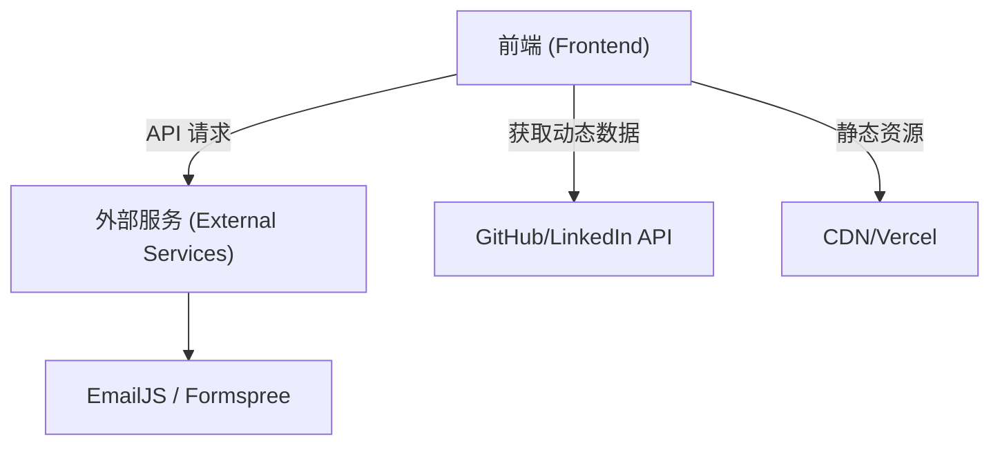
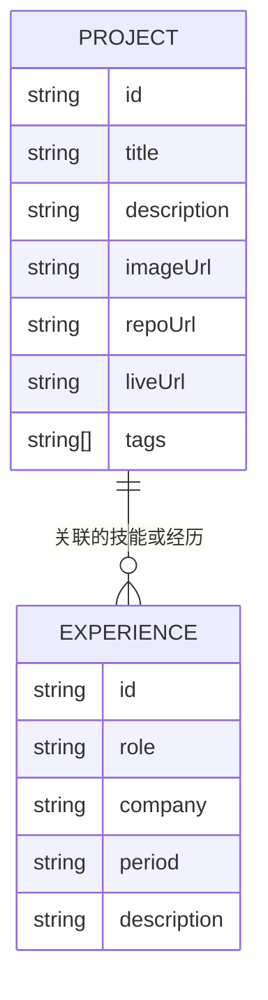

## 1. 架构设计


## 2. 技术栈说明
- 前端框架：React@18 + tailwindcss@3 + vite
- 初始化工具：vite-init 或 npm create vite@latest
- 状态管理：React Context API (适用于简单的个人主页)
- 动画库：Framer Motion (用于实现页面加载和滚动动效)
- 图标库：Lucide React 或 React Icons
- 字体：Google Fonts 或本地自定义字体 (如: Space Grotesk / Syne)

## 3. 路由定义
| 路由 | 目的 |
|-------|---------|
| / | 首页，包含所有的个人简介和核心内容 |
| /projects | 展示所有开源项目和作品 |
| /about | 详细的个人履历和教育背景 |
| /contact | 联系方式和留言表单 |

## 4. API 定义 (如果存在后端)
本项目主要为静态展示页面，如需动态获取 GitHub 数据，可调用 GitHub API：
```typescript
interface GitHubRepo {
  id: number;
  name: string;
  description: string;
  html_url: string;
  stargazers_count: number;
  language: string;
}

// 示例：获取个人仓库列表
// GET https://api.github.com/users/{username}/repos
```

## 5. 服务器架构图 (如果存在后端)
（本项目为纯前端静态页面，无需独立后端服务，表单提交可依赖第三方服务如 Formspree）

## 6. 数据模型 (如果适用)
### 6.1 数据模型定义


### 6.2 数据定义语言
前端采用本地 JSON 配置文件或静态数组来管理项目和履历数据：
```typescript
export const projects = [
  {
    id: '1',
    title: '个人博客系统',
    description: '基于 React 和 Next.js 构建的高性能静态博客。',
    imageUrl: '/assets/blog.png',
    repoUrl: 'https://github.com/username/blog',
    liveUrl: 'https://blog.example.com',
    tags: ['React', 'Next.js', 'TailwindCSS']
  }
];
```
