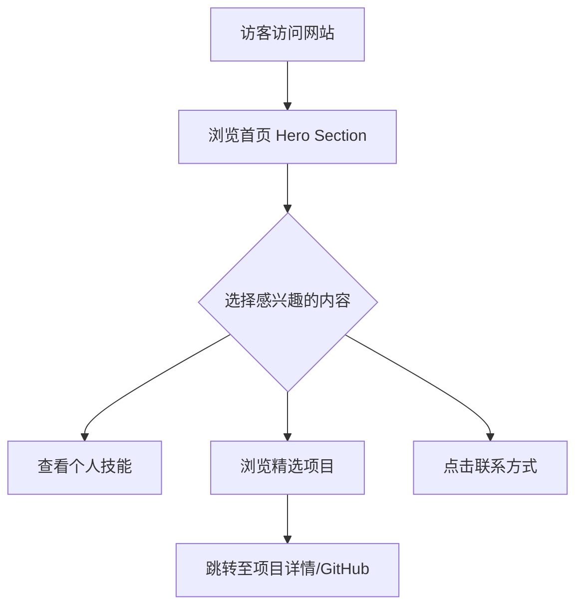

## 1. 产品概述
这是一个用于展示个人履历、技能、项目经验和博客文章的个人主页。
- 主要目的是为访客（HR、技术同行或客户）提供一个了解个人的专业窗口，展示技术实力和个人品牌。
- 产品的核心价值在于提供一个高美感、响应式且易于维护的线上名片。

## 2. 核心功能

### 2.1 角色定义
| 角色 | 注册方式 | 核心权限 |
|------|---------------------|------------------|
| 访客 | 无需注册 | 浏览所有公开的个人信息、项目和文章 |

### 2.2 功能模块
1. **首页 (Home)**: 包含个人简介 (Hero Section)、核心技能展示、最新项目预览、社交媒体链接。
2. **项目页 (Projects)**: 详细展示个人参与或主导的开源项目及商业项目，支持分类和外链。
3. **关于我 (About)**: 详细的个人履历、教育背景、工作经历。
4. **联系方式 (Contact)**: 提供邮箱、GitHub、LinkedIn等联系渠道。

### 2.3 页面详情
| 页面名称 | 模块名称 | 功能描述 |
|-----------|-------------|---------------------|
| 首页 | Hero Section | 展示具有视觉冲击力的个人Slogan、头像及主打技能，支持动态文字或打字机效果。 |
| 首页 | 技能与专长 | 以可视化图表或徽章列表形式展示技术栈。 |
| 首页 | 最新项目 | 轮播或网格展示最新完成的2-3个精选项目。 |
| 项目页 | 项目列表 | 瀑布流或网格展示所有项目，点击可查看详情或跳转至GitHub/在线预览。 |
| 关于我 | 履历时间轴 | 以时间轴形式直观展示教育及工作经历。 |
| 底部导航 | Footer | 包含版权信息及各社交平台的快捷链接。 |

## 3. 核心流程
用户进入网站后，通过首页快速了解博主，进而通过导航栏深入查看项目或履历。

## 4. 用户界面设计
### 4.1 设计风格
- 主副色调：采用极简的黑白灰搭配，辅以高饱和度的强调色（如电光蓝或荧光绿）用于按钮和链接，打造现代科技感。
- 按钮样式：微发光边缘的圆角按钮，带有平滑的 Hover 过渡动画。
- 字体：使用具有设计感的无衬线字体（如 Inter 或 Roboto 的替代品），搭配特色展示字体（Display Font）用于大标题。
- 布局风格：大量留白（Negative Space），不对称排版，采用网格系统（Grid System）打破常规的居中布局。
- 动效建议：页面加载时元素的错落淡入（Staggered Fade-in），滚动时的视差效果（Parallax），以及平滑的锚点跳转。

### 4.2 页面设计总览
| 页面名称 | 模块名称 | UI 元素 |
|-----------|-------------|-------------|
| 首页 | Hero Section | 巨大的加粗标题、动态渐变背景或噪点纹理、显眼的 Call-to-Action 按钮。 |
| 项目页 | 项目卡片 | 悬浮阴影、悬停时放大并显示项目详情的遮罩层、响应式图片。 |
| 关于我 | 履历时间轴 | 垂直线条连接的节点、平滑滚动的动画触发器。 |

### 4.3 响应式设计
- 优先采用桌面端设计（Desktop-first），通过媒体查询向下兼容平板及移动设备。
- 移动端采用汉堡菜单（Hamburger Menu）替代顶部导航，项目卡片转为单列布局，优化触摸区域大小。
